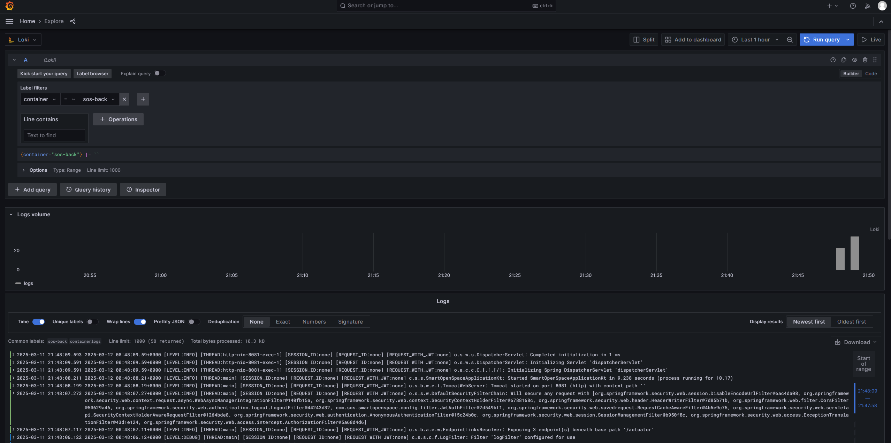
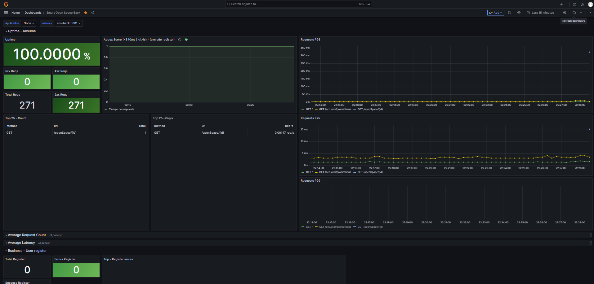
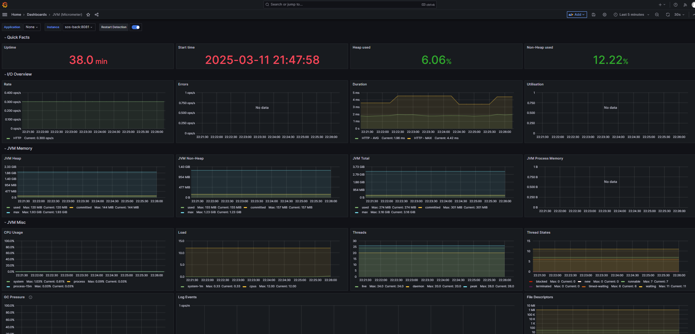
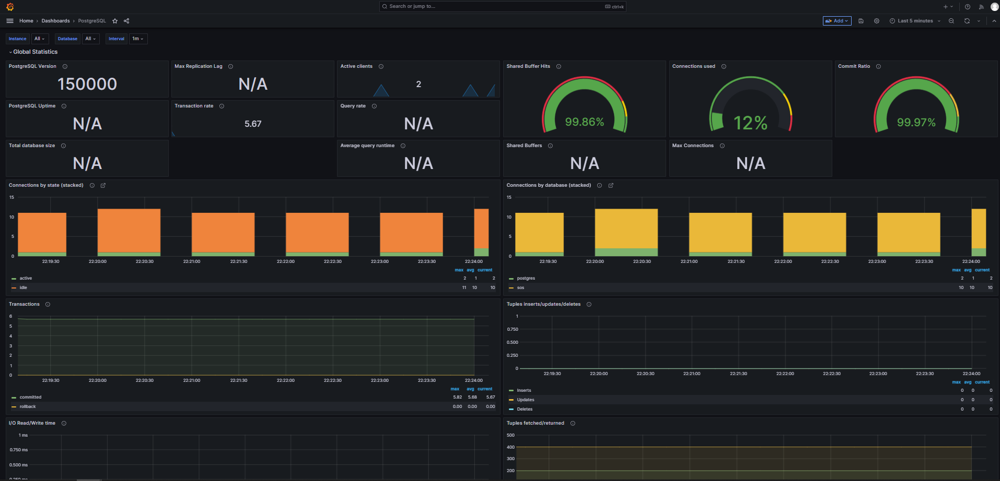
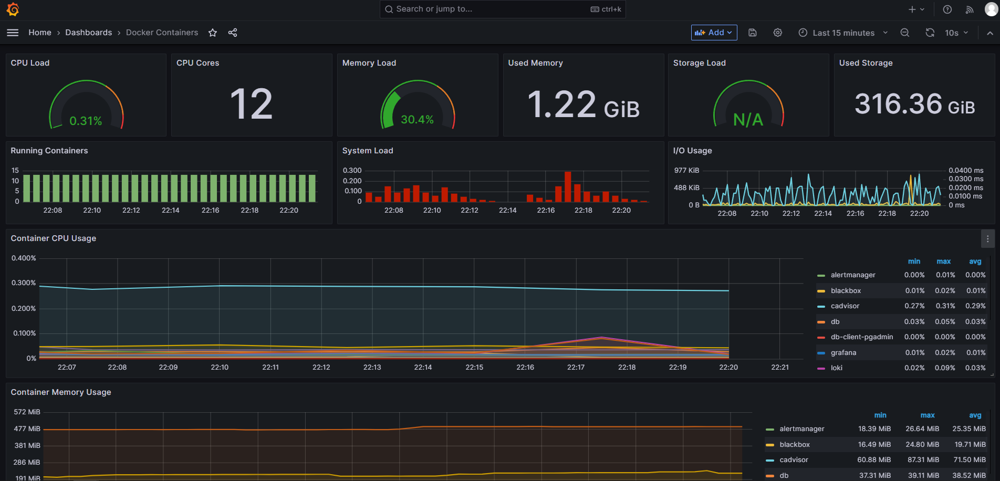
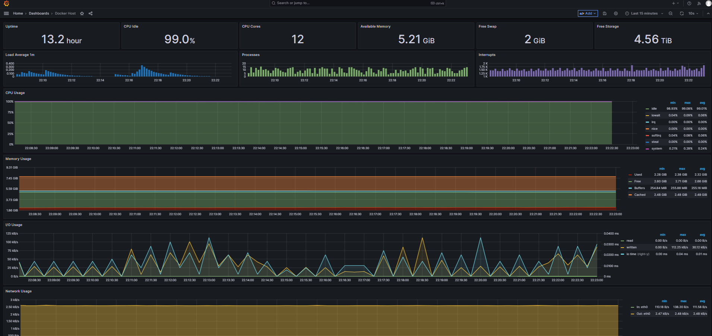
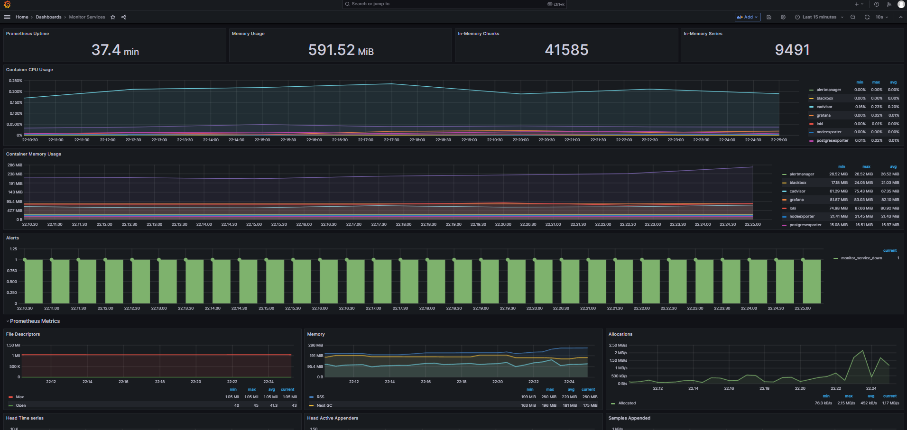

# Grafana

- [Datasources](#datasources)
- [Alertas](#alertas)
- [Dashboards](#dashboards)
- [Loki Logs](#loki---logs)
- [Dashboards](#dashboards)

## Datasources

Los datasources son las fuentes de datos donde grafana va a obtener la información para visualizarla. Ejemplos de datasources: prometheus, loki, tempo, etc.

Para dejar configuraciones estaticas de los datasources y no perderlos, se debe agregar en el archivo yml de [grafana/provisioning/datasources/datasource.yml](/docs/container/grafana/provisioning/datasources/datasource.yml).

## Alertas

A nivel configuración estatica de codigo se encuentran varias alertas configurados por prometheus y alertmanager. Estas se encuentran en [prometheus/alert.rules](/docs/container/prometheus/alert.rules). Si se desean agregar, se puede siguiendo el formato de las alarmas existentes.

Luego para configurar alertas en grafana, revisar la guía en la carpeta de [grafana/alerts](/docs/container/grafana/alerts/README.md).

## Loki - Logs 

Se ingresa por la sección de Explore y seleccionando Loki. 

Ahi se puede filtrar por container y son provistos por promtail. Se puede integrar a futuro desde la app back con spring boot, pero requiere una integración interna. 

Captura de Loki en Grafana:

## Dashboards

Para guardar dashboards en el repositorio y no perderlos, se debe exportar en json y copiarlo en la carpeta [grafana/provisioning/dashboards](/docs/container/grafana/provisioning/dashboards). Guardar en el mismo archivo si el dashboard ya existia o crear un nuevo archivo en caso de nuevo dashboard.

### Capturas de dashboards principales

#### Dashboard custom de app back

#### Dashboard default JVM micrometer

#### Dashboard postgres

#### Dashboard contenedores 

#### Dashboard host

#### Dashboard servicios de monitoreo

