## Grafana - Guia configuracion alerta


Se realizó esta guia por la dificultad que se encuentra de editar y/o eliminar alertas importadas.

Esta guía esta desarrollada con la configuración de alerta del apdex de sos-back-app, pero cambiando algunos campos y dashboards puede servir para cualquier otra. Tambien se puede dirigir al dashboard deseado y generar la alerta desde ahi.


Tambien, en el presente directorio se encuentra el archivo [alert_apdex_grafana.yaml](alert_apdex_grafana.yaml) donde se puede tratar de importar dicha alarma.

### Requisitos

- Tener las aplicaciones de SOS, observalidad y monitoreo ejecutando y saludables.
- Tener algun webhook de discord para realizar notificaciones.

### 1) Configurar Contact Points

Ir a ["alermanager/config.yaml"](/docs/container/alertmanager/config.yml)

Revisar integracion con discord, luego agregar el webhook de nuestro canal, por ejemplo:
        
    - Webhook URL: https://discord.com/api/webhooks/1123340873990090782/EN05jIXlHv5HXr7588-R20fis2GPoqReCTq4aS3kvE4oLSSgMnj9dqODhGxivLXIc_0usk

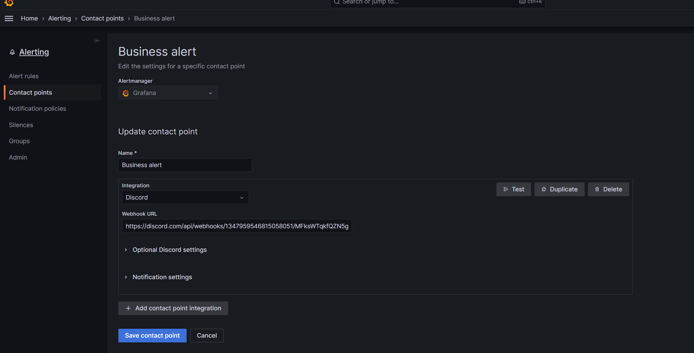


### 2) Configurar Notification policies con los valores que se encuentran en la imagen de debajo:

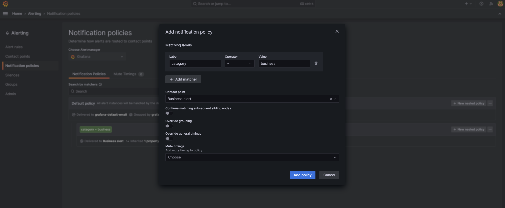


### 3) Configuración de alarmas en dashboards de grafana:

Una vez que tenemos los receptores y su manejos de alertas configurados. 

Vamos a cargar las reglas de alertas, dirigiendonos al dashboard deseado, le damos a editar, vamos al tab "alert". En este caso, sería el dashboard de apdex:


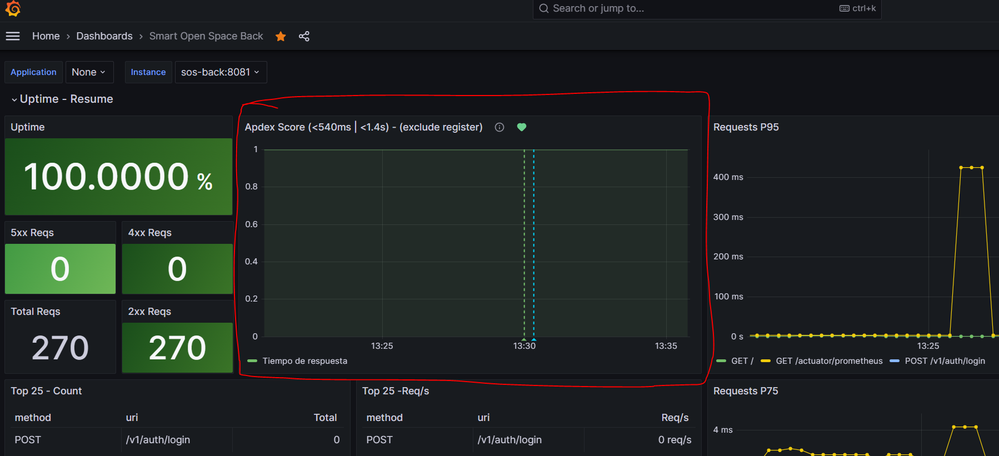

Le damos a crear al boton "Create alert rule from this panel" (cuidado: no todo dashboard puede aplicar y reportará un error):

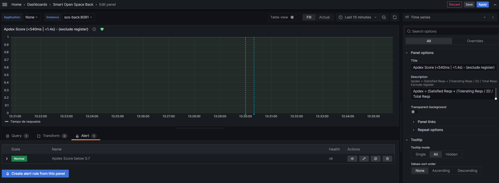


### 4) Luego dentro pondremos la query deseada con sus opciones (si es el apdex, se pueden utilizar los datos provistos en texto como en imagenes, sino revisar que datos se desean):

```promql
(
  sum(rate(server_request_seconds_bucket{instance="sos-back:8081", uri!="/v1/auth/register", le="0.536870911"}[$__range])) 
  +
  (
    sum(rate(server_request_seconds_bucket{instance="sos-back:8081", uri!="/v1/auth/register", le="1.431655765"}[$__range])) 
    - sum(rate(server_request_seconds_bucket{instance="sos-back:8081", uri!="/v1/auth/register", le="0.536870911"}[$__range])) 
  ) / 2
) / 
sum(rate(server_request_seconds_bucket{instance="sos-back:8081", uri!="/v1/auth/register", le="+Inf"}[$__range]))
```


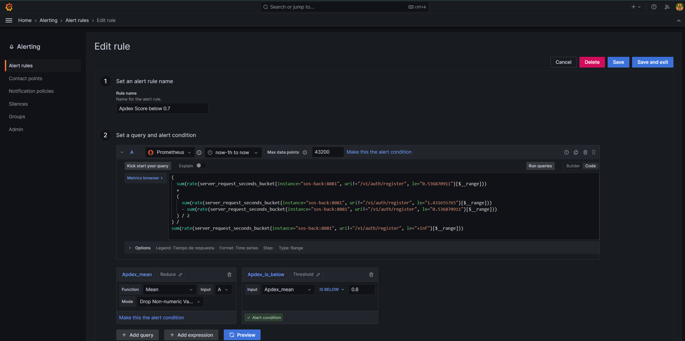

En el paso (4) de crear la alerta, agregar el annotation "Summary" con el siguiente texto y reemplazamos el campo `<umbral>`:

```text
In last hour, apdex average is below than <umbral>
```

Luego en el paso (5) de crear la alerta, se debe agregar los "Labels" (si es apdex, sino a eleccion):
 - category = business
 - severity = critical

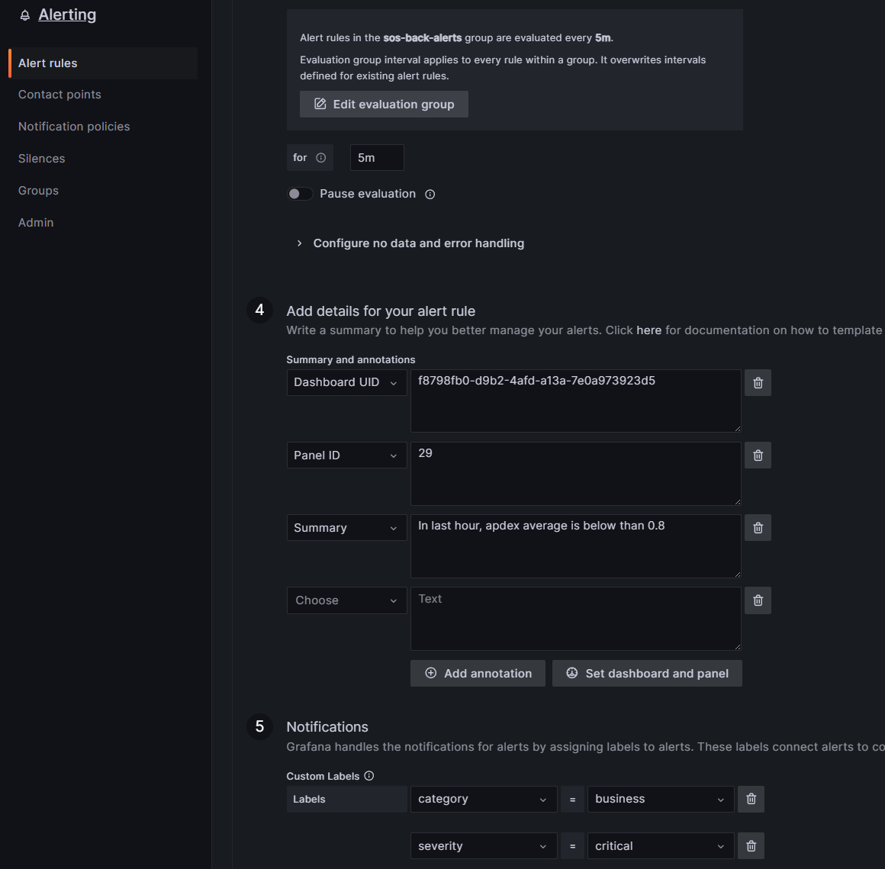

### 5) Prueba de alarma

- Para esto, modificaremos momentaneamente el umbral para que se dispare siempre. Recordemos que el apdex va entre valores del 0 a 1. Entonces, pondremos un umbral de "1.5", para que probemos como se dispara la alarma y si genera todos los eventos de notificación que configuramos correctamente.


  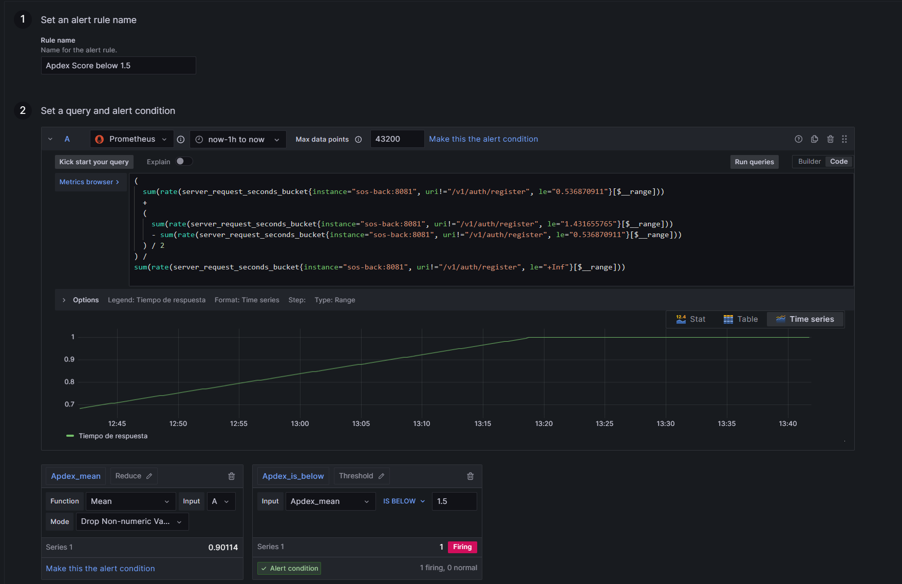
  _En la imagen de arriba podemos ver que ya la alarma se evalúa como que se dispara_


- Luego, iremos a la sección de alarmas de grafana y veremos como cambia el status de la alarma a "Pending", donde queda pendiente de evaluar si sigue superando el umbral con los valores definidos:
  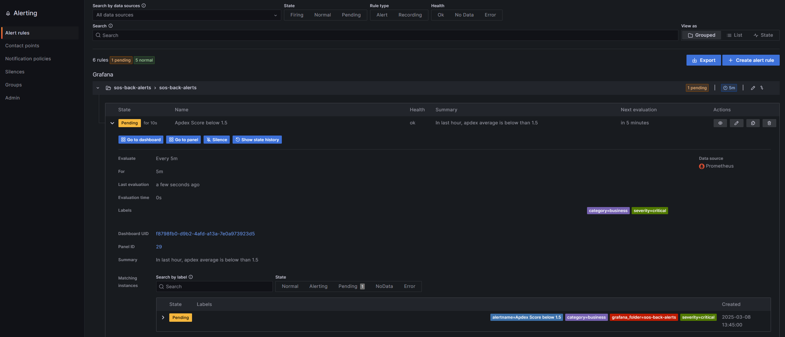

- Pasado el tiempo de tolerancia, se dispara las alarmas en los medios configurados (Discord en este caso):
  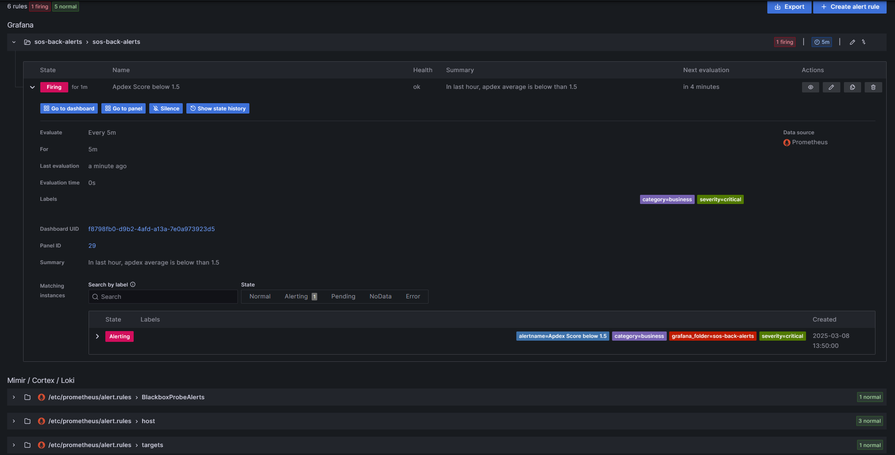

  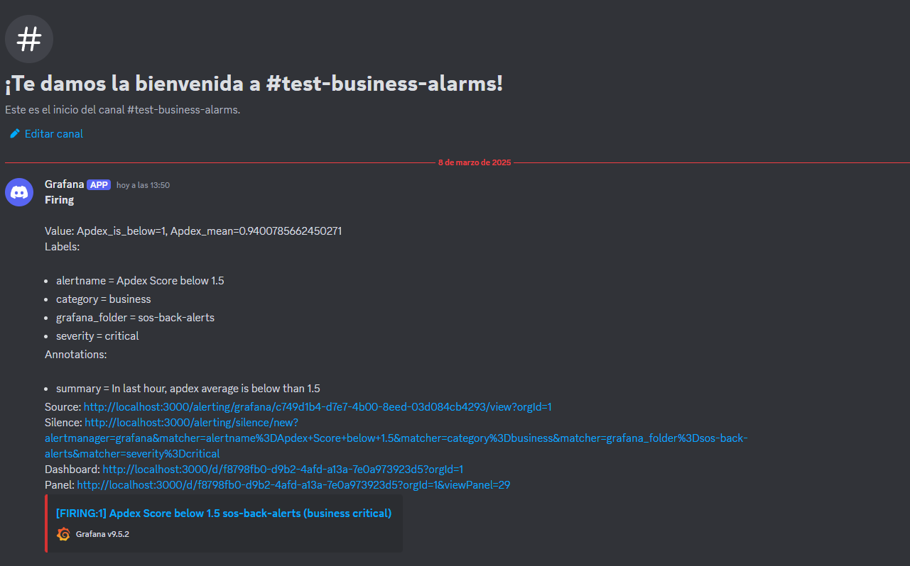

- Volvemos la alarma con el umbral y configuración anterior, y automaticamente la alarma se normaliza:
  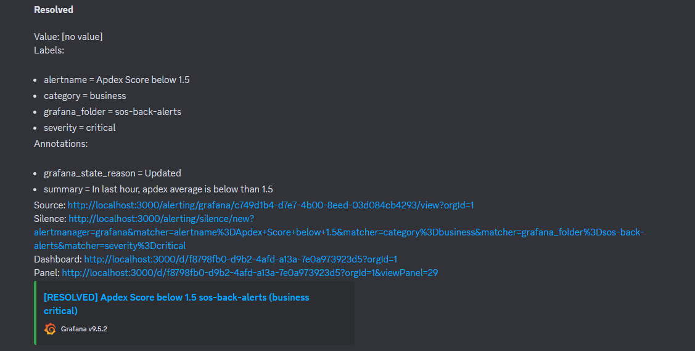
